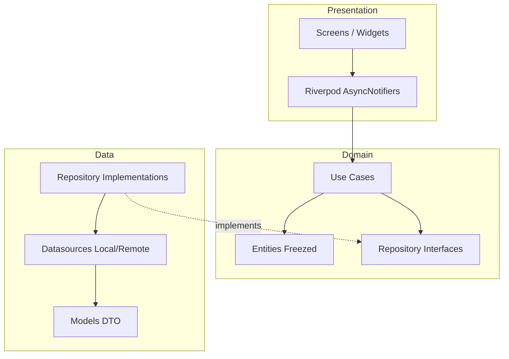

# BTG Funds App

> Prueba técnica Flutter para la vacante Mobile Developer en PersonalSoft / BTG Pactual

[](https://github.com/jhonsua/btg-funds-app/actions/workflows/ci.yml)
[](https://github.com/jhonsua/btg-funds-app/actions/workflows/pages.yml)
[](https://codecov.io/gh/jhonsua/btg-funds-app)
[](https://github.com/jhonsua/btg-funds-app/actions)
[](https://docs.flutter.dev/)
[]()

Aplicación Flutter para gestión de fondos voluntarios de pensión (FPV) y fondos de inversión colectiva (FIC). Incluye suscripciones, cancelaciones, historial con filtros y notificaciones multi-canal (email / SMS). Construida con Clean Architecture, Riverpod, persistencia local y atomicidad pessimistic en operaciones críticas.

---

## Acceso rápido

- **Demo en vivo:** https://jhonsua.github.io/btg-funds-app/
- **Releases (APK + AAB + Web):** https://github.com/jhonsua/btg-funds-app/releases
- **Dashboard de cobertura:** https://app.codecov.io/gh/jhonsua/btg-funds-app
- **Pipelines CI/CD:** https://github.com/jhonsua/btg-funds-app/actions

La demo en vivo persiste el estado en `localStorage` del navegador. Para resetear el estado de prueba, usa el botón "Restablecer cuenta de demo" en la pestaña Perfil.

---

## Resumen funcional

La aplicación simula la operación de un cliente con un saldo inicial de COP $500.000 que puede:

- Suscribirse a cinco fondos del catálogo (FPV y FIC) con validación de monto y selección de canal de notificación.
- Consultar sus posiciones activas y cancelar participaciones, recibiendo el reintegro al saldo.
- Revisar el historial completo de transacciones con filtros combinables por tipo y por fondo.
- Configurar su perfil (email, teléfono, canal preferido) y restablecer la cuenta de demo cuando lo necesite.

Cada suscripción genera atómicamente la posición, la transacción y la actualización del saldo. La cancelación replica el comportamiento en reverso. Las validaciones son en tiempo real con feedback diferenciado por severidad (error / warning) sin bloquear al usuario en diálogos modales.

El catálogo de fondos sigue los datos del PDF original de la prueba (cinco fondos con montos mínimos entre COP $50.000 y COP $250.000).

---

## Stack y arquitectura

### Tecnologías principales

- **Flutter 3.41.5** y Dart 3.11.3 (canal stable)
- **Riverpod 2** con AsyncNotifier para state management reactivo
- **GoRouter 14** con StatefulShellRoute.indexedStack para navegación con tabs persistentes
- **Freezed** para entidades inmutables y unions sealed
- **Dartz** para Either<Failure, T> y manejo funcional de errores
- **SharedPreferences** para persistencia local (compatible con web)
- **Mocktail + integration_test** para testing
- **GitHub Actions + Codecov** para CI/CD y reporte de cobertura

### Arquitectura

El proyecto aplica Clean Architecture con tres capas por feature, dependencias unidireccionales y separación estricta de responsabilidades.



Cada feature (`user`, `funds`, `subscriptions`, `transactions`) replica la misma estructura:

```
lib/features/<feature>/
├── data/          (datasources, models, repositories)
├── domain/        (entities, repository interfaces, use cases)
└── presentation/  (notifiers, screens, widgets)
```

Capas transversales en `core/` (theme, validators, atomic write, app config), `shared/` (widgets reutilizables) y `app/` (routing, shell responsivo).

### Manejo funcional de errores

Los use cases retornan `Either<Failure, T>` (de dartz). `Failure` es una jerarquía sealed con casos `BusinessFailure`, `CacheFailure`, `ValidationFailure`. Los notifiers consumen el `Either` y emiten `AsyncValue` para que la UI sepa cómo presentar el resultado (loading, success, error con copy específico).

```dart
abstract class SubscribeToFundUseCase {
  Future<Either<Failure, Subscription>> call({
    required String fundId,
    required double amount,
    required NotificationChannel channel,
  });
}
```

Este patrón evita try/catch dispersos y obliga a manejar el caso de error en cada consumidor.

---

## Ambientes

El proyecto define dos flavors Android (configurados en `android/app/build.gradle`) y dos entry points Dart separados (`lib/main_dev.dart` y `lib/main_prod.dart`). El flavor activo determina el `applicationId`, el `versionName`, los delays simulados de carga y los datos de seed.

### Flavor `dev`

- `applicationId`: `com.personalsoft.btg.btg_funds_app.dev`
- Delays simulados en datasources: 600ms (visible para validar skeletons y empty states)
- Permite reset de datos de demo sin restricciones
- Es el flavor usado por todos los workflows excepto release (CI, integration tests, Pages)

### Flavor `prod`

- `applicationId`: `com.personalsoft.btg.btg_funds_app`
- Delays simulados reducidos a 300ms (más cercano a producción real)
- Firma con keystore production-grade (RSA 2048, validez 10000 días, SHA384withRSA)
- Es el flavor usado únicamente en el workflow `release.yml` al pushear un tag `v*.*.*`

### Configuración inyectada en runtime

El archivo `AppConfig` se construye según el flavor activo y se expone como un provider Riverpod:

```dart
final appConfigProvider = Provider<AppConfig>((ref) {
  return const AppConfig(
    simulatedLatency: Duration(milliseconds: 600),
    flavor: AppFlavor.dev,
  );
});
```

En `main_prod.dart` el provider se sobreescribe con `Duration(milliseconds: 300)` y flavor `prod`. En integration tests se sobreescribe con `Duration.zero` para que los tests no esperen los delays simulados.

Este patrón permite parametrizar el comportamiento de la app sin acoplar lógica a `bool kReleaseMode`, manteniendo el código testeable.

---

## Despliegue y CI/CD

El proyecto tiene cuatro workflows de GitHub Actions, todos productivos y verificados end-to-end. Cada uno tiene un propósito específico y triggers independientes para no bloquearse mutuamente.

### Workflow `ci.yml`

Corre en cada push a `main` y en cada pull request. Valida:

- `dart format --output=none --set-exit-if-changed .` (formato consistente)
- `flutter analyze --fatal-infos` (sin warnings)
- `flutter test --coverage` (171 unit tests verdes)
- Upload del coverage a Codecov con flag `unit`

Tiempo típico: 2 a 3 minutos. Usa caché de pub-cache y SDK Flutter para acelerar reruns.

### Workflow `pages.yml`

Corre en cada push a `main`. Construye la app web en modo release con `--base-href "/btg-funds-app/"` y la despliega a GitHub Pages usando el modelo moderno (`deploy-pages` action, no la branch `gh-pages` legacy).

El resultado queda disponible en https://jhonsua.github.io/btg-funds-app/ pocos minutos después de cada merge. Tiempo típico: 1 a 2 minutos.

### Workflow `integration_tests.yml`

Corre en pull requests, manualmente vía `workflow_dispatch` y cada noche a las 02:00 UTC vía `schedule`. NO corre en cada push a `main` para no inflar el tiempo de los pushes simples.

Configura un emulador Android API 33 (`reactivecircus/android-emulator-runner@v2`) con KVM acceleration y caché de AVD. Ejecuta los 7 integration tests con retry de hasta 3 intentos para mitigar la flakiness intrínseca del emulador en CI. Sube el coverage a Codecov con flag `integration`.

Codecov combina automáticamente ambos flags (`unit` + `integration`) y reporta el coverage merged en el dashboard. Tiempo típico: 6 a 10 minutos.

### Workflow `release.yml`

Corre cuando se pushea un tag `v*.*.*`. Genera tres artefactos firmados con el keystore real:

- APK universal (~50 MB) instalable directamente en dispositivos Android
- AAB (~42 MB) listo para subir a Google Play Console
- ZIP del build web (~13 MB) servible desde cualquier hosting estático

El keystore real se inyecta en CI decodificando un GitHub Secret (`KEYSTORE_BASE64`) y generando `android/key.properties` en runtime desde otros tres secrets (`STORE_PASSWORD`, `KEY_PASSWORD`, `KEY_ALIAS`). Ningún material sensible queda en el repo ni en logs.

Después del build, el workflow ejecuta `apksigner verify --verbose` sobre el APK generado para validar la firma criptográfica. Si el APK conserva el debug certificate, el workflow falla deliberadamente.

Finalmente, crea un GitHub Release con los tres assets adjuntos. La versión se extrae del tag (sin el prefijo `v`), y los tags que contienen `-` (ej: `v0.0.2-test`) se marcan automáticamente como prerelease.

Tiempo típico: 5 a 6 minutos.

### Despliegue a producción real

Los artefactos generados están listos para los canales oficiales de distribución, aunque la publicación a tiendas no es parte de este alcance. El proceso productivo sería:

**Google Play (Android):**

1. Crear cuenta de desarrollador (USD $25 una sola vez).
2. Crear la app en Play Console con el `applicationId` `com.personalsoft.btg.btg_funds_app`.
3. Subir el AAB a la pista de Internal Testing y agregar testers.
4. Promover sucesivamente: Internal → Closed Testing → Open Testing → Production.
5. Cada release usa el mismo keystore (perderlo invalida todas las actualizaciones futuras).

**Huawei AppGallery (Colombia):**

Mercado relevante en Colombia por base instalada de dispositivos Huawei legacy (sin Google Services tras el ban de USA en 2019). El proceso de publicación es similar al de Google Play y consta de cuatro pasos:

1. Crear cuenta de desarrollador en `developer.huawei.com` con verificación de identidad (cédula). La cuenta puede ser Individual o Enterprise. El registro es gratuito.
2. Crear la app en AppGallery Connect con el `applicationId` (en este proyecto sería `com.personalsoft.btg.btg_funds_app`) y los metadatos básicos.
3. Subir el artefacto (APK o AAB, ambos aceptados desde 2023), agregar screenshots (mínimo 3, máximo 2MB c/u), descripción y categoría.
4. Enviar a revisión. El equipo de Huawei revisa en un plazo de 1 a 5 días y aprueba la publicación.

Esta app no requiere integración con HMS Core (Push Kit, Map Kit, etc.) porque no usa servicios de Google que necesiten reemplazo. El APK universal generado por `release.yml` es compatible directamente con AppGallery sin modificaciones. Para automatizar el upload existe el plugin oficial `Huawei AppGallery Publish Gradle Plugin`, integrable en `release.yml` con credenciales adicionales.

**App Store Connect (iOS):**

La app no compila iOS en este alcance (`ios: false` en flutter_launcher_icons). Para habilitar iOS habría que: agregar `lib/main_ios.dart` o un flavor equivalente, configurar certificados de Apple Developer Program (USD $99 anuales), generar el IPA con `flutter build ipa`, y subir a App Store Connect para distribuir vía TestFlight antes de App Store.

### Distribución a tiendas: estado actual y siguiente paso

El workflow `release.yml` **genera** los artefactos firmados (APK + AAB + Web ZIP) en cada tag `v*.*.*` y los adjunta a un GitHub Release público. Lo que falta para **publicación automática** a tiendas es el step de upload usando las APIs oficiales:

- **Google Play:** action `r0adkll/upload-google-play@v1` o Fastlane `supply`. Requiere service account JSON con permisos en Play Console y la app ya creada en Internal Testing.
- **Huawei AppGallery:** plugin Gradle oficial o llamada manual a la AGC API. Requiere `client_id` y `client_secret` de AppGallery Connect.
- **App Store Connect:** Fastlane `pilot` (TestFlight) o `deliver` (App Store). Requiere API key de App Store Connect, y previamente el proyecto debe compilar iOS.

Estos pasos no se incluyeron en esta prueba técnica porque requieren cuentas de desarrollador activas con la app ya creada en cada tienda. El pipeline está preparado para agregarlos: solo es cuestión de configurar los secrets correspondientes y agregar el step en `release.yml`.

**Aclaración sobre hosting web:** Vercel, Cloudflare Pages, Netlify y similares son alternativas para hostear el build web (no para distribuir apps móviles a tiendas). Sirven el mismo `build/web/` que GitHub Pages, con ventajas como CDN global, deploy preview por PR y custom domain con TLS automático. Para esta demo se usó GitHub Pages por simplicidad e integración nativa con el repo.

### Codecov y reporte de cobertura

Los dos workflows (`ci.yml` e `integration_tests.yml`) suben coverage a Codecov con flags distintos. Codecov combina automáticamente ambos uploads del mismo commit y reporta tres métricas: coverage solo unit, coverage solo integration, y coverage combinado. El badge dinámico en este README refleja el coverage combinado.

Este enfoque (unit e integration separados con merge en Codecov) es estándar de proyectos con CI maduro. Permite que el CI principal sea rápido (sin emulador) y que el reporte final refleje cobertura honesta sin doble medición.

---

## Decisiones técnicas clave

Esta sección documenta las decisiones de diseño tomadas conscientemente durante el desarrollo, con sus trade-offs y alternativas descartadas.

### Atomicidad pessimistic en operaciones críticas

Las operaciones que tocan múltiples llaves de `SharedPreferences` (suscripción, cancelación, reset) son atómicas mediante el helper `AtomicWrite` con stage + commit + rollback. Una suscripción modifica balance + posiciones + transacciones; si la app crashea entre escrituras, el estado quedaría inconsistente (saldo descontado sin posición registrada). En banca, eso es inaceptable. Alternativa descartada: Hive con `Box.transaction` — agregaba dependencia y complicaba web; para el alcance, el helper custom es suficiente.

### SnackBarBehavior.fixed (bug latente revelado por testing)

Cambiado de `floating` (default Material 3) a `fixed` porque `floating` produce overflow en viewports con altura ≤750dp — exactamente la audiencia de gama media-baja Android. Bug latente durante todo el desarrollo, revelado por `pumpAndSettle()` en integration tests (los `pump(Duration)` arbitrarios anteriores lo ocultaban). Lección: tests determinísticos revelan bugs que tests con timing fijo esconden.

### Coverage merged con flags de Codecov

Unit e integration miden cosas distintas y son complementarios — unit cubre paths de error con mocks, integration cubre código real de widgets. `ci.yml` sube con flag `unit`, `integration_tests.yml` con flag `integration`, Codecov mergea automáticamente. Resultado: coverage combined ~90%, reportado honestamente con desglose por capa. Alternativa descartada (merge local antes de upload único): hubiera obligado a esperar el emulador Android en cada push.

### Otras decisiones

- **GitHub Pages para la demo (vs Vercel y similares):** Pages es la integración más simple para un repo público sin cuentas adicionales. En producción real BTG/PersonalSoft, la elección dependería del stack corporativo: Cloudflare Pages/Vercel para velocidad de iteración, CloudFront+S3 si AWS, Azure Static Web Apps si Azure.
- **`Either<Failure, T>` en use cases:** garantiza manejo de errores en compile-time vs try/catch dispersos. Jerarquía sealed (`BusinessFailure`, `CacheFailure`, `ValidationFailure`).
- **`InlineValidationMessage` en lugar de SnackBar/Dialog:** errores de formulario inline con distinción visual por severidad (rojo/dorado). No bloquean UI, persisten mientras el error persiste, desaparecen al corregir.
- **Cuatro workflows separados:** detallado en sección de Despliegue. Permite CI rápido (3 min) sin sacrificar cobertura completa.
- **APK universal vs `--split-per-abi`:** un único APK de ~50MB para distribución directa. AAB hace split automáticamente vía Play Store.

---

## Testing strategy

El proyecto tiene **179 tests verdes** distribuidos en dos tipos complementarios:

- **171 unit tests** (`test/`): cubren domain (use cases, entities), data (repositories, datasources) y widgets aislados. Usan mocktail para mockear dependencias y validar paths de error.
- **7 integration tests** (`integration_test/`, 8 testWidgets en total): cubren flujos end-to-end con la app real en Android emulator. Validan happy path, validaciones inline, reset demo, filtros de historial y comportamiento responsive.

### Cobertura por capa

Coverage combinada **~90%** (unit + integration merged por Codecov):

- **app/**: 95% unit / 100% integration / **100% combined**
- **shared/**: 86% unit / 85% integration / **86% combined**
- **domain/**: 86% unit / 68% integration / **86% combined**
- **data/**: 87% unit / 72% integration / **90% combined**
- **core/**: 81% unit / 71% integration / **87% combined**
- **presentation/**: 63% unit / 88% integration / **91% combined**

**Lectura honesta:** presentation tiene solo 63% en unit porque saltamos widget tests masivos a favor de integration tests. La justificación está en la sección de decisiones: prefiero 7 integration tests que validan flujos completos sobre 30 widget tests que verifican que cada card renderiza sin crashear.

### Integration tests: flujos cubiertos

1. **Happy path completo** — 21 pasos: cold start, suscripción, posiciones, cancelación, historial.
2. **Reset demo end-to-end** — 18 pasos: suscribir 2 fondos, cambiar perfil, reset, validar preservación.
3. **Validación de saldo insuficiente** — 9 pasos: error con `InlineValidationMessage` rojo.
4. **Validación de monto mínimo** — 10 pasos: warning dorado distinguible del error rojo.
5. **Transición de severities** — 5 fases: warning → error → limpio sin duplicación del widget.
6. **Filtros de historial** — 15 pasos: filtrar por tipo, por fondo, clear via InputChip.onDeleted.
7. **Responsive shell** — 2 sub-tests: BottomNavigationBar a 360dp, NavigationRail a 1200dp.

### Determinismo y robustez

Los integration tests evitan deliberadamente `pump(Duration(seconds: X))` arbitrarios y `Future.delayed`. En su lugar usan `pumpAndSettle()` determinístico, `ScaffoldMessenger.hideCurrentSnackBar()` para dismiss explícito, y `SharedPreferences.setMockInitialValues({})` en cada `setUp` para garantizar estado limpio entre tests.

---

## Cómo correr localmente

### Prerequisites

- **Flutter 3.41.5** stable (`flutter --version`)
- **Dart 3.11.3** (viene con Flutter)
- **Java 17** para builds Android (`java -version`)
- **Android Studio** con Android SDK (para generar APK/AAB)
- **Git** y acceso al repositorio

### Instalación

```bash
git clone https://github.com/jhonsua/btg-funds-app.git
cd btg-funds-app
flutter pub get
```

### Correr la app

```bash
# Flavor dev en Chrome (más rápido para iteración)
flutter run --flavor dev -t lib/main_dev.dart -d chrome

# Flavor dev en emulador o dispositivo Android
flutter run --flavor dev -t lib/main_dev.dart

# Flavor prod (requiere keystore configurado, ver abajo)
flutter run --flavor prod -t lib/main_prod.dart
```

### Tests

```bash
# Unit tests con coverage
flutter test --coverage

# Integration tests (requiere emulador/dispositivo Android)
flutter test integration_test/ --flavor dev

# Suite individual de integration test
flutter test integration_test/flows/subscribe_happy_path_test.dart --flavor dev
```

### Build release (firmado)

Para builds release firmados localmente, copiar `android/key.properties.example` a `android/key.properties` y completar con un keystore propio:

```bash
cp android/key.properties.example android/key.properties
# Editar key.properties con tu keystore real
# El .jks debe estar en android/app/upload-keystore.jks o ruta indicada

bash scripts/release-build.sh
```

El script genera APK, AAB y Web ZIP en `release-artifacts/`. Sin `key.properties`, los builds debug funcionan pero los release usan debug signing automático.

### Setup post-clone para CI/CD (solo si vas a forkear)

Si querés replicar el pipeline completo en tu propio fork:

1. **GitHub Pages:** Settings → Pages → Source = "GitHub Actions" + Environments → github-pages → permitir `main`.
2. **Codecov:** crear cuenta en codecov.io, autorizar el repo, agregar `CODECOV_TOKEN` como GitHub Secret.
3. **Release signing (opcional):** agregar 4 secrets adicionales para `release.yml`:
   - `KEYSTORE_BASE64`: keystore encoded con `base64 -i upload-keystore.jks | tr -d '\n'`
   - `STORE_PASSWORD`, `KEY_PASSWORD`, `KEY_ALIAS`: credenciales del keystore.

Sin estos secrets, los workflows funcionan pero `release.yml` produce APK con debug signing automático.

---

## Hallazgos durante el desarrollo

Esta sección documenta bugs descubiertos durante el proceso y deuda técnica documentada honestamente. No es lista de fallas — es evidencia de que el testing funcionó.

- **SnackBar floating overflow en gama baja Android:** bug latente durante todo el desarrollo, revelado por `pumpAndSettle()` en integration tests. Fix de 1 línea en `app_theme.dart`. Detalle en sección de Decisiones técnicas.
- **Race condition con GitHub Secrets:** durante setup del keystore, configurar secrets mientras un workflow estaba en ejecución hizo que `${{ secrets.X }}` se expandiera como string vacío. Lección: GitHub Actions resuelve secrets al disparo, no on-demand.
- **Flakiness emulador Android en CI:** mitigado con retry de hasta 3 intentos en `scripts/run_integration_tests.sh`. En la práctica pasa en primer intento la mayoría de runs.
- **Dead code defensivo en validación de decimales:** rama inalcanzable hoy (`FilteringTextInputFormatter.digitsOnly` filtra el punto antes). Mantenido como *defense in depth* para futuras formas de input (paste, autofill).
- **`updateUser(preferredChannel)` post-suscripción:** comportamiento legítimo pero discutible UX. Pre-selecciona último canal usado en próxima suscripción. Deuda UX documentada para evaluación de producto.

---

## Autor

**Jhon Suárez** — Mobile Developer

- GitHub: [@jhonsua](https://github.com/jhonsua)
- Ubicación: Bucaramanga, Colombia
- Postulación: Mobile Developer en PersonalSoft (proyecto BTG Pactual)

---

## Disclaimer legal

Esta es una prueba técnica con fines de evaluación. La marca **BTG Pactual**, su logotipo, y los nombres de fondos (FPV / FIC) son propiedad de **Banco BTG Pactual S.A.**. Los datos mostrados son ilustrativos y la app no tiene afiliación comercial con BTG Pactual.

El uso del logo BTG en los íconos de esta aplicación se realiza en el contexto exclusivo de una prueba técnica para una vacante laboral relacionada con BTG vía PersonalSoft. No constituye uso comercial ni implica representación oficial de la marca.

---

## Licencia

© 2026 Jhon Suárez. Todos los derechos reservados.

Este proyecto fue desarrollado como prueba técnica para postulación a vacante Mobile Developer en PersonalSoft. El código está disponible públicamente para fines de evaluación. No se concede licencia de uso, modificación, distribución o uso comercial sin autorización explícita del autor.
